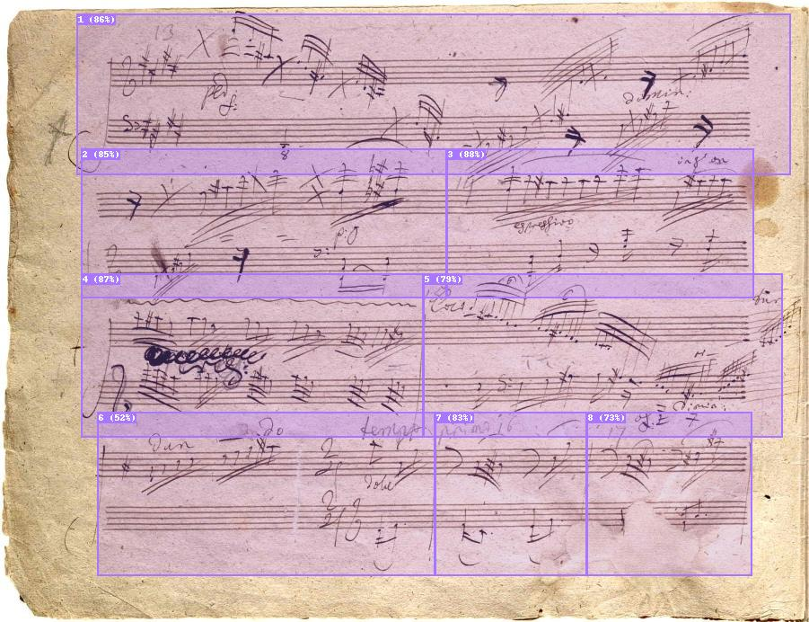

# Measure Detector

[](https://creativecommons.org/licenses/by-nc-sa/4.0/)




## Build and Run the Microservice

To build the Docker container and start the Measure Detector microservice, follow the instructions below:

### Build Docker Container

Use the following command to build the Docker container:
```shell
docker build -t measure-detector .
```

### Start the Microservice
To start the microservice, execute the following command:
```shell
docker run -t -p 8123:8123 -e WORKERS=1 measure-detector
```

If you have a GPU available, make sure you have the [NVIDIA Container Toolkit](https://docs.nvidia.com/datacenter/cloud-native/container-toolkit/install-guide.html#installation-guide) properly installed. Then, use the following command to start the microservice:
```shell
docker run --gpus all -t -p 8123:8123 -e WORKERS=1 measure-detector
```
The choice of `WORKERS` determines the trade-off between latency and maximum throughput. For fast detection and handling few simultaneous requests, it is recommended to set `WORKERS=1`. Jobs are queued if all workers are currently in use.

⚠️ Keep in mind that the memory requirements scale linearly with the number of workers. A single worker uses about 4.2 GB of memory.


## Usage
The Measure Detector microservice exposes four endpoints:

- `POST /json`: returns JSON with detected measure bounding boxes (supports multiple files)
- `POST /mei`: returns an MEI XML document with `<surface>`, `<zone>`, and `<measure>` across all uploaded pages (supports multiple files)
- `POST /debug`: returns a JPEG debug image with drawn bounding boxes for a single file
- `GET /health`: simple health probe that returns `{ "status": "ok", "version": "..." }`

The bounding boxes provided in the response are normalized values relative to the image. The `class_id` field corresponds to either `0` for handwritten measures or `1` for typeset measures.

Here is an example using `curl` to get bounding boxes for one or more images:
```shell
$> curl -s \
  -F 'files=@/path/to/page1.jpg' \
  -F 'files=@/path/to/page2.jpg' \
  -F "auto=y" \
  -F "pretty=y" \
  localhost:8123/json

# example output
{
  "process_time": 227,
  "results": [
    {
      "filename": "page1.jpg",
      "type": "handwritten",
      "type_confidence": 0.987,
      "measures": [
        {
          "class_id": 0,
          "class_name": "handwritten",
          "confidence": 0.801,
          "bbox": { "x1": 0.0654, "y1": 0.04745, "x2": 0.25965, "y2": 0.24122 }
        }
      ]
    },
    {
      "filename": "page2.jpg",
      "type": "typeset",
      "type_confidence": 0.934,
      "measures": [
        { "class_id": 1, "class_name": "typeset", "confidence": 0.628, "bbox": { "x1": 0.24641, "y1": 0.05258, "x2": 0.48787, "y2": 0.24263 } }
      ]
    }
  ]
}
```

To obtain an MEI file across multiple images:
```shell
$> curl -s \
  -F 'files=@/path/to/page1.jpg' \
  -F 'files=@/path/to/page2.jpg' \
  localhost:8123/mei -o measures.mei
```

### Options
Endpoints accept additional boolean options as key/value pairs in the FormData:
| Option   | Description                                                                                                                   |
|----------|-------------------------------------------------------------------------------------------------------------------------------|
| `trim`   | Trim left and right boundaries of the detected measures to prevent overlap. Works best on typeset scores.                     |
| `expand` | Expand the upper and lower boundaries of the detected measures so that all measures within the same system have equal height. |
| `auto`   | Automatically determine and use the best combination of `trim` and `expand` based on the input image.                         |
| `pretty` | Pretty-prints JSON (`/json`) or XML (`/mei`) responses when true.                                                              |

Boolean values can be specified using various formats: `t`, `true`, `1`, `y`, and `yes`. Any other value will be regarded as false.

### Debug image (`/debug`)
Submit exactly one file using `multipart/form-data` to receive a JPEG with overlays. The same `trim`, `expand`, and `auto` options apply.
```shell
curl -s \
  -F 'file=@/path/to/page.jpg' \
  -F 'auto=y' \
  localhost:8123/debug > debug.jpg
```

Example debug overlay result:


## Notes
- The server automatically resizes all incoming images to 1280px (long edge). For larger images, it's recommended to resize them client-side before uploading to reduce transfer time.
- The detection model is trained to cope with high JPEG compression levels. However, good overall image quality improves the detection in most cases.
- Uneven lighting of the score images has significant impact on the detection quality.
- To increase general security, it's highly advised to use a reverse proxy with HTTPS support. External tools such as NGINX, HAProxy, traefik, or caddy can be used for this purpose.
 - OpenAPI docs are available at `http://localhost:8123/docs` and `http://localhost:8123/redoc`.
 - CORS is enabled permissively by default for convenience; restrict origins in production via reverse proxy or by editing the middleware configuration.

## 📦 Model Weights via Hugging Face Hub

The YOLOv5 weights (`model.pt`) are not stored in this repository. They are downloaded at startup from Hugging Face Hub.

- Default location: `sonovice/measure-detector` with file `model.pt` on `main`.
- Configure via environment variables:
  - `HF_REPO_ID` (default: `sonovice/measure-detector`)
  - `HF_MODEL_FILENAME` (default: `model.pt`)
  - `HF_REVISION` (default: `main`)

Caching: the model file is pre-fetched into the image at build time and used at runtime. You can override the path via `MODEL_PATH`.
On CPU-only hosts (e.g., arm64), the image installs CPU wheels for PyTorch during build; performance expectations differ from CUDA-enabled hosts.

## License

This project is licensed under the Creative Commons Attribution-NonCommercial-ShareAlike 4.0 International (CC BY-NC-SA 4.0) license.

Summary: You may share and adapt non-commercially with attribution. Full terms: https://creativecommons.org/licenses/by-nc-sa/4.0/